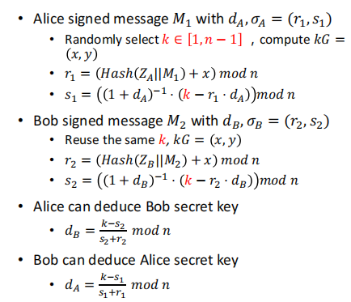

# verify pitfalls
## 项目简介

## 项目代码说明
### ECDSA签名

### SM2签名

### SM2验签

### 泄露k会导致泄露d

### SM2签名重复使用k

### SM2 signature: reusing k by different users

### SM2 signature: same d and k with ECDSA

## 实验结果
### 泄露k会导致泄露d

### SM2签名重复使用k

### SM2 signature: reusing k by different users

### SM2 signature: same d and k with ECDSA
